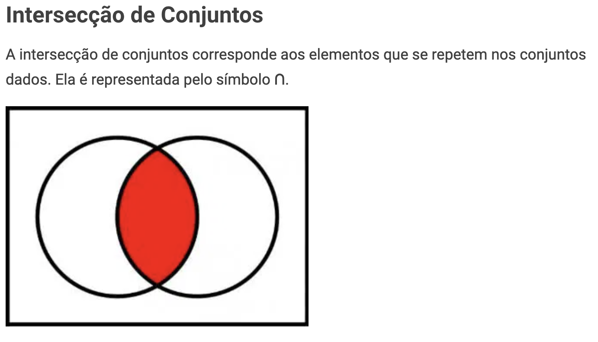

# 🛡️ AWS Permissions Boundary no IAM: O Que É e Como Funciona?

**AWS Permissions Boundary** é um recurso essencial para controlar permissões em ambientes corporativos complexos, oferecendo uma camada adicional de segurança no IAM (Identity and Access Management). Veja neste README como funciona, em quais cenários aplicá-lo e os cuidados necessários para usá-lo.


## 📌 O que é Permission Boundary?

**Permission Boundary** é uma política de segurança dentro do AWS IAM que define o limite máximo de permissões que uma entidade (como um usuário ou role) pode obter, independente das políticas anexadas a ela.

> **Exemplo:** Se uma Permission Boundary especifica acesso apenas à leitura no S3, um usuário com permissões de administrador, mas restrito pela Permission Boundary, terá apenas esse acesso de leitura ao S3.


> <sub> Fonte: Imagem obtida de [docs.aws.amazon.com](https://docs.aws.amazon.com/pt_br/IAM/latest/UserGuide/access_policies_boundaries.html).</sub>


> <sub>Fonte: Imagem obtida de [todamateria.com.br](https://www.todamateria.com.br/operacoes-com-conjuntos/)</sub>

## 🛠️ Qual Problema Permission Boundary Resolve?

Permission Boundary é útil para resolver problemas de:
- **Excesso de permissões**: Evita que um usuário ou role receba permissões acima do permitido.
- **Delegação de permissões com segurança**: Permite que administradores concedam permissões com segurança, sem correr o risco de excessos.
- **Compliance e auditoria**: Ajuda a garantir que nenhuma entidade consiga permissões além das necessárias, essencial em ambientes com requisitos regulatórios.

## 📖 Exemplos Práticos de Uso

1. **Controle de permissões em ambientes multi-conta**: Ao conceder permissões em uma conta de produção, um Permission Boundary impede que desenvolvedores elevem acidentalmente privilégios.
2. **Isolamento de funções temporárias**: Para funcionários temporários, Permission Boundaries limitam acesso a operações específicas, sem risco de alterar configurações críticas.
3. **Políticas de terceiros**: Permissions Boundary pode limitar o alcance de permissões atribuídas a serviços de terceiros, garantindo maior segurança em integrações.
4. **Filtros avançados com tags e IPs**: Possibilidade de aplicar filtros adicionais, como **tags** e **IP de origem**, para restringir acessos a recursos somente de dentro da rede ou de fontes confiáveis, reforçando o controle e segurança das permissões.

## 📝 Exemplo de Configuração com Permission Boundary

Neste exemplo, temos:
- **Permission Boundary**: Limita o usuário a apenas ler objetos no S3.
- **Identity-based policy** (Administrador): Concede permissões administrativas gerais ao usuário.

Mesmo com permissões de administrador, o usuário será restrito pelo Permission Boundary, resultando em acesso somente de leitura ao S3.

### 1️⃣ Permission Boundary (Restringindo a Leitura no S3)

```json
{
  "Version": "2012-10-17",
  "Statement": [
    {
      "Effect": "Allow",  #<--------- IMPORTANTE!
      "Action": [
        "s3:GetObject",
        "s3:ListBucket"
      ],
      "Resource": [
        "arn:aws:s3:::example-bucket",
        "arn:aws:s3:::example-bucket/*"
      ]
    }
  ]
}
```

### 2️⃣ Identity-based Policy (Administração Completa)

```json
{
  "Version": "2012-10-17",
  "Statement": [
    {
      "Effect": "Allow",
      "Action": "*",
      "Resource": "*"
    }
  ]
}
```

### Resultado

Com essa configuração:
- **O usuário terá permissão de administrador**, mas devido à **Permission Boundary**, só conseguirá **listar e ler objetos no bucket S3 especificado**.
- Qualquer outra ação no bucket (como `s3:PutObject`) será bloqueada pela Permission Boundary, mesmo que esteja na policy de administrador.

---

Esses exemplos ajudam a visualizar o funcionamento das Permission Boundaries, destacando como elas restringem permissões com um controle preciso sobre as ações permitidas.

---

## 🧠 Quando Usar e Quando Não Usar

- **Usar quando**: É preciso limitar permissões específicas, proteger recursos críticos, ou estabelecer regras em ambientes de uso compartilhado.
- **Não usar quando**: A estrutura de permissões é simples e sem necessidade de restrições adicionais além das políticas de IAM; Permission Boundaries podem adicionar complexidade desnecessária.


## ⚠️ Pontos de Atenção

- **Desempenho**: Permissions Boundary não impacta desempenho diretamente, mas pode complicar o gerenciamento de permissões, principalmente em contas multi-usuário.
- **Monitoramento**: Revisar frequentemente as políticas associadas para evitar permissões obsoletas ou incoerentes.
- **Documentação**: Mantenha a documentação clara sobre onde e por que Permissions Boundary foi implementado, para facilitar auditorias e gestão futura.

---

- 📚 **Treinamentos**: [Treinamentos](https://mugnos-it.com/treinamentos/)

---

- 🧑‍🏫 **Nome**: [Douglas Mugnos](https://mugnos-it.com)
- 🎥 **YouTube**: [@DouglasMugnosit](https://www.youtube.com/@DouglasMugnosit)
- 📷 **Instagram**: [douglasmugnosit](https://www.instagram.com/douglasmugnosit/)
- 🌐 **Website**: [Mugnos-it](https://mugnos-it.com)
