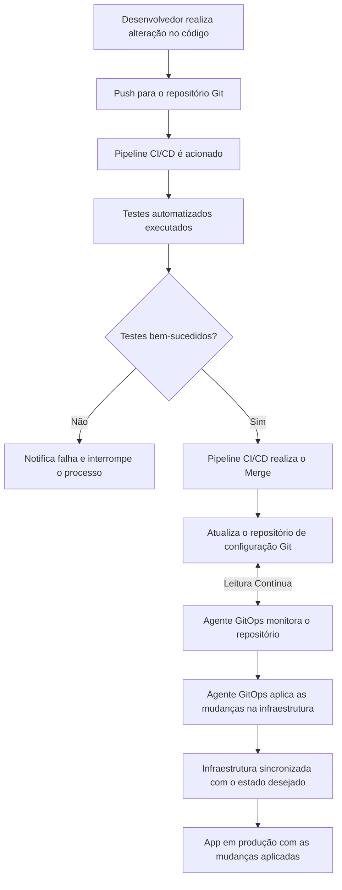

# 🤖 O que é GitOps ? Como utilizar e quais os benefícios ?

- GitOps é uma abordagem que une **controle de versão** e **automação** para gerenciamento de infraestrutura e aplicações em ambientes de cloud.
- Ele utiliza repositórios **Git como única fonte de verdade** para configurar e operar o ambiente, promovendo eficiência e rastreabilidade.
- GitOps é uma prática de **gestão de infraestrutura e operações** que centraliza todo o controle no Git. 
- A infraestrutura desejada é armazenada em repositórios Git(IaC - Imutável), e as mudanças são aplicadas através de pipelines automatizados, garantindo que o estado atual do ambiente esteja sempre sincronizado com o código.

## 📜 História e Origem
O conceito surgiu em 2017 pela **Weaveworks** para resolver o problema de confiabilidade e repetibilidade na gestão de ambientes de cloud, principalmente em Kubernetes. GitOps se popularizou por oferecer uma maneira consistente e auditável de gerenciar sistemas complexos, com forte controle de mudanças e automação.

## 🛠️ Problema que GitOps Resolve
GitOps simplifica a administração da infraestrutura com:
- **Controle de versão**: Todos os estados e mudanças ficam rastreados.
- **Automação**: Reduz erros humanos em deploys.
- **Consistência**: Garante que a infraestrutura está sempre em conformidade com a configuração desejada.

## 💡 Benefícios do GitOps
1. **Rastreabilidade Total**: Cada mudança é registrada e auditável.
2. **Velocidade e Consistência**: Deploys frequentes e consistentes, com menos intervenção manual.
3. **Automação e Escalabilidade**: Infraestrutura gerenciada como código permite replicar ambientes e escalar operações.

  
## 🚀 Principais Ferramentas de GitOps
Diversas ferramentas implementam GitOps, especialmente em ambientes de Kubernetes:
- **FluxCD**: Ferramenta open-source pela Weaveworks, focada em CI/CD.
- **ArgoCD**: Populares em comunidades de Kubernetes, oferecendo fácil integração e automação para GitOps.
- **Jenkins X**: Integra CI/CD com automação GitOps.
  
Essas ferramentas ajudam a sincronizar as configurações de infraestrutura com os repositórios Git, monitorando e aplicando as alterações automaticamente.

---

📚 **Treinamentos**: [Treinamentos](https://mugnos-it.com/treinamentos/)

---

🧑‍🏫 **Nome**: [Douglas Mugnos](https://mugnos-it.com)  
🎥 **YouTube**: [@DouglasMugnosit](https://www.youtube.com/@DouglasMugnosit)  
📷 **Instagram**: [douglasmugnosit](https://www.instagram.com/douglasmugnosit/)  
🌐 **Website**: [Mugnos-it](https://mugnos-it.com)  
