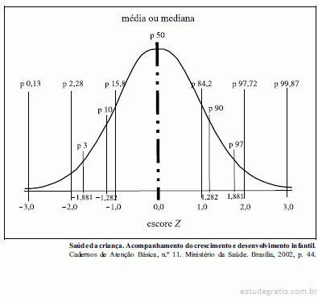

# P99, P95, P90 e Métricas de Latência Explicadas

Vamos nos aprofundar nas métricas de latência, especialmente os percentis **P99** e **P90**, ferramentas essenciais para quem busca otimizar o desempenho de aplicações. Compreender esses percentis permite identificar padrões de resposta do sistema e melhorar significativamente a experiência do usuário.

## O que é Latência?

- Latência é o tempo que um sistema leva para responder a uma solicitação. 
- Em app, a latência se refere ao intervalo entre o momento em que um usuário faz uma requisição e a resposta do sistema. 
- Essa medida é crítica para o desempenho, pois reflete diretamente a eficiência com que um sistema atende aos seus usuários.
- Altas latências geralmente indicam problemas no sistema, que podem afetar a satisfação do usuário.

## Percentis e Métricas de Latência


> Fonte: EstudeGratis (https://www.estudegratis.com.br/questao-de-concurso/210352).

Quando medimos a latência, usamos percentis para analisar a distribuição dos tempos de resposta. Um percentil divide um conjunto de dados em partes, o que nos ajuda a compreender como a latência se comporta na maioria dos casos e identificar exceções de alto tempo de resposta.

### O Que é o P99?

O percentil **P99** (99º percentil) indica o tempo máximo de latência experimentado por 99% das requisições. Em outras palavras, ele mostra quanto tempo demoraram as 99% requisições mais rápidas, deixando de fora as 1% mais lentas. O P99 é importante para identificar picos de latência e momentos em que o sistema está sobrecarregado. Com essa métrica, você consegue monitorar os "outliers", ou seja, aqueles poucos casos em que a aplicação responde de forma mais lenta e que, por isso, merecem atenção.

Exemplo prático:
> Se o P99 de uma aplicação está em 900 ms, significa que em 99% dos casos, as requisições são atendidas em até 900 ms, enquanto apenas 1% delas excedem esse tempo. Em sistemas críticos, onde cada milissegundo conta, monitorar o P99 ajuda a evitar que a experiência do usuário seja prejudicada pelos piores tempos de resposta.

### O Que é o P90?

O percentil **P90** (90º percentil) mostra a latência máxima para 90% das requisições, sendo uma métrica útil para medir a "performance mediana". Ele desconsidera os 10% de tempos mais lentos, oferecendo uma visão mais realista da latência sob condições normais de operação.

Exemplo prático:
> Se o P90 está em 400 ms, isso indica que 90% das requisições são atendidas em até 400 ms, enquanto os 10% restantes podem ser mais lentos. Isso é útil para detectar a consistência no desempenho sem ser afetado pelos outliers.

## Por que P99 e P90 são Importantes?

Essas métricas são essenciais para identificar o comportamento de uma aplicação em produção, especialmente em sistemas que requerem alta performance. Ao monitorar o P99 e o P90, é possível:

- **Identificar gargalos**: Compreender quais partes da aplicação têm tempos de resposta fora do normal e que precisam de otimização.
- **Antecipar problemas**: Detectar tendências de aumento de latência, o que ajuda a tomar ações preventivas antes que afetem o usuário final.
- **Tomar decisões informadas**: Saber onde focar os esforços de otimização e manutenção com base em dados claros de desempenho.

## Exemplos Matemáticos: Comparação entre Média e P90

Aqui estão dois exemplos matemáticos que demonstram por que o P90 pode ser mais informativo do que a média.

### Exemplo 1: Sistema com 8 Requisições Rápidas e 2 Lentas

Considere um sistema com 10 requisições com os seguintes tempos de resposta (em milissegundos):

```plaintext
1, 1, 1, 1, 1, 1, 1, 1, 1000, 1000
```

1. **Média:** Somando todos os tempos, temos 1008 ms. Dividindo por 10 requisições, a média é:
    ```plaintext
    Média = 2008 / 10 = 200.8 ms
    ```

2. **Percentil P90:** Ordenando os tempos, o valor do 90º percentil (9º valor na lista) é:
    ```plaintext
    P90 = 1000 ms
    ```

**Conclusão:** A média sugere um tempo de resposta moderado de 200.8 ms, mas o P90 indica que 90% das requisições foram atendidas em até 1000 ms, evidenciando que uma parte significativa das requisições é lenta.

## Como encontrar o percentil

Dado uma lista de 100 valores, para calcular o **P90**:
1. Organize os valores em ordem crescente.
2. Calcule a posição do percentil: 
$$
\text{Posição} = N \times \frac{\text{Percentil Desejado}}{100}
$$
    Onde:
    - (N) é o número total de elementos na lista.
    - (Percentil Desejado) é o percentil que queremos calcular (por exemplo, 90 para P90).


3. Encontre o valor na 90ª posição da lista ordenada.
4. O valor nessa posição é o P90 da lista.

## Conclusão

Monitorar e entender métricas de latência como P99 e P90 é fundamental para quem busca aprimorar a performance de aplicações modernas. Com essas métricas, você obtém uma visão detalhada dos tempos de resposta, detecta gargalos e pode fazer ajustes pontuais para manter a experiência do usuário sempre positiva.

---

- 📚 **Treinamentos**: [Treinamentos](https://mugnos-it.com/treinamentos/)

---

- 🧑‍🏫  **Nome**: [Douglas Mugnos](https://mugnos-it.com)
- 🎥 **YouTube**: [@DouglasMugnosit](https://www.youtube.com/@DouglasMugnosit)
- 📷 **Instagram**: [douglasmugnosit](https://www.instagram.com/douglasmugnosit/)
- 🌐 **Website**: [Mugnos-it](https://mugnos-it.com)

