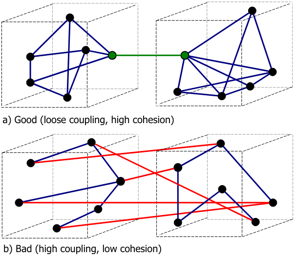

# Alto Acoplamento (Tight Coupling) vs Baixo Acoplamento (Loose Coupling)

## O que é Acoplamento?

O acoplamento refere-se ao nível de dependência entre diferentes módulos ou componentes de um sistema. No contexto de aplicativos e microserviços, o acoplamento se refere a como esses serviços interagem entre si e a extensão em que mudanças em um serviço afetam outros serviços.

Imagem do site: https://en.wikipedia.org/wiki/Coupling_%28computer_programming%29

| **Alto Acoplamento (Tight Coupling)**| **Baixo Acoplamento (Loose Coupling)**|
|--------------------------------------------------------------------------------------------------------------------------|--------------------------------------------------------------------------------------------------------------------------|
| **Alto Acoplamento (Tight Coupling)** ocorre quando dois ou mais módulos ou microserviços dependem fortemente uns dos outros. Quando um componente ou serviço é alterado, os outros que estão fortemente acoplados também precisam ser modificados ou ajustados, o que pode aumentar a complexidade e o risco de introduzir erros no sistema. | **Baixo Acoplamento (Loose Coupling)** ocorre quando os módulos ou microserviços têm poucas ou nenhuma dependência direta entre si. Eles podem funcionar de forma autônoma, e uma mudança em um serviço tem pouco ou nenhum impacto nos demais. Esse nível de independência facilita a escalabilidade, manutenção e testes dos serviços individualmente. |
| **Características**:|**Características**:|
| - **Dependência direta** entre serviços ou módulos. - Alterações em um módulo ou serviço requerem alterações nos outros. - Difícil de testar e manter individualmente. - **Flexibilidade limitada** em termos de escalabilidade e atualizações. | - **Independência** entre serviços ou módulos. - Alterações em um módulo não exigem mudanças nos outros. - **Facilidade de manutenção**, teste e escalabilidade. - Melhor suporte para deploys independentes e mais flexibilidade em evoluções. |
| **Exemplos**:| **Exemplos**:|
| - Um microserviço A depende diretamente dos dados ou lógica do microserviço B para funcionar. Se o B for alterado, o A pode falhar ou precisar ser atualizado. - Módulos que compartilham diretamente o mesmo banco de dados ou possuem uma integração rígida, como chamadas síncronas diretas entre eles. | - Microserviços que se comunicam por eventos assíncronos ou APIs, com contratos bem definidos que não exigem mudanças no código dos consumidores. - Cada microserviço possui seu próprio banco de dados ou camada de persistência, evitando dependências diretas. |
| **Use Cases**:| **Use Cases**:|
| - Sistemas de Controle Industrial - Sistemas Legados - Sistemas de ERP - Sistemas Embarcados - de baixa Latência (Questionável)  - Dependência de Frameworks - Compartilhamento de Estado - Requisitos de Conformidade | - Microsserviços de E-commerce - Aplicações Web Escaláveis - Sistemas de Mensageria Assíncronos - Processamento de Big Data - Integração via APIs - Arquiteturas de Nuvem Distribuídas |

## Alto Acoplamento (Tight Coupling) vs Baixo Acoplamento (Loose Coupling) em Microserviços

No contexto de microserviços, o **Baixo Acoplamento (Loose Coupling)** é amplamente preferido. Microserviços devem ser projetados para operar de forma autônoma, com comunicações assíncronas e responsabilidades bem definidas, o que torna o sistema mais resiliente e escalável.

Imagem do site: https://en.wikipedia.org/wiki/Coupling_%28computer_programming%29

### Comparação:

| **Aspecto**         | **Alto Acoplamento (Tight Coupling)**                            | **Baixo Acoplamento (Loose Coupling)**                         |
|---------------------|-------------------------------------------------|-----------------------------------------------|
| **Manutenção**       | Difícil de manter devido a interdependências    | Fácil de manter com serviços independentes    |
| **Escalabilidade**   | Limitada pela dependência entre componentes     | Altamente escalável, cada serviço evolui sozinho |
| **Testabilidade**    | Testes complexos por conta das dependências     | Facilita testes individuais e isolados        |
| **Resiliência**      | Falhas em um serviço afetam outros              | Falhas são contidas no serviço afetado        |
| **Flexibilidade**    | Dificuldade para adaptar ou trocar serviços     | Serviços podem ser modificados sem impacto geral |

## Conclusão

Para arquiteturas de microserviços, o **Baixo Acoplamento (Loose Coupling)** é o ideal, pois promove a independência entre os serviços, facilita a escalabilidade e reduz os riscos de falhas em cascata. Já o **Alto Acoplamento (Tight Coupling)** pode gerar complexidade, dificultar manutenção e testar os serviços de forma isolada, além de limitar a flexibilidade do sistema como um todo.
Ou seja, Sempre que possivel, evite acoplamento em arquitetura e software.
