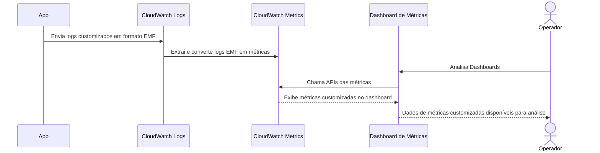

# 📊 CloudWatch EMF: O Que É e Como Monitorar Métricas Personalizadas Com CloudWatch EMF

## O que é o Amazon CloudWatch?

O Amazon CloudWatch é o serviço de monitoramento da AWS, usado para coletar, visualizar e alertar sobre métricas e logs de aplicações e infraestrutura na nuvem. Ele oferece:
- **Observabilidade**: Visão unificada da saúde e performance.
- **Automação**: Alertas e respostas automáticas.
- **Custo-efetivo**: Reduz a necessidade de gerenciar servidores para monitoramento.

## Motivação do CloudWatch Embedded Metric Format (EMF) / Formato de Métrica Incorporada

Antes do **EMF**, integrar métricas personalizadas no CloudWatch era mais complexo, exigindo chamadas frequentes à API `PutMetricData`, o que aumentava custos e complexidade. O EMF simplifica esse processo ao permitir que você envie **logs que são automaticamente convertidos em métricas**, unificando dados de logs e métricas.

### Problema Resolvido pelo EMF
- **Unificação de Logs e Métricas**: Facilita a análise, correlacionando logs com métricas sem precisar gerenciar serviços separados.
- **Redução de Custos e Complexidade**: Reduz chamadas diretas para a API de métricas, aproveitando logs para gerar métricas automaticamente.

## Antes do EMF vs. Com EMF

### Antes do EMF: Usando `PutMetricData`

Para enviar uma métrica personalizada ao CloudWatch sem EMF, você precisaria chamar a API `PutMetricData` manualmente para cada métrica, como no exemplo a seguir:

```go
package main

import (
	"github.com/aws/aws-sdk-go/aws"
	"github.com/aws/aws-sdk-go/aws/session"
	"github.com/aws/aws-sdk-go/service/cloudwatch"
)

func main() {
	sess := session.Must(session.NewSession(&aws.Config{Region: aws.String("us-east-1")}))
	svc := cloudwatch.New(sess)

	// Envia um ponto de métrica personalizado
	_, err := svc.PutMetricData(&cloudwatch.PutMetricDataInput{
		Namespace: aws.String("MinhaAplicacao"),
		MetricData: []*cloudwatch.MetricDatum{
			{
				MetricName: aws.String("TempoDeProcessamento"),
				Unit:       aws.String("Milliseconds"),
				Value:      aws.Float64(123.45),
			},
		},
	})

	if err != nil {
		panic(err)
	}
}
```

**Desvantagens**:
- Chamadas frequentes e diretas para a API `PutMetricData`.
- Maior complexidade e custo.
- Difícil de correlacionar logs e métricas.

### Com EMF: Enviando Logs que Geram Métricas Automáticas

Com o **CloudWatch EMF**, você envia os dados como logs em um formato específico. O CloudWatch lê esses logs e gera métricas automaticamente, sem precisar chamar a `PutMetricData`. Veja o exemplo:

```json
{
    "_aws": {
        "Timestamp": 1609459200000,
        "CloudWatchMetrics": [
            {
                "Namespace": "MinhaAplicacao",
                "Dimensions": [["Environment"]],
                "Metrics": [
                    {"Name": "TempoDeProcessamento", "Unit": "Milliseconds"}
                ]
            }
        ]
    },
    "Environment": "Production",
    "TempoDeProcessamento": 123.45
}
```

Exemplo:

```go
package main

import (
	"encoding/json"
	"fmt"
	"time"

	"github.com/aws/aws-sdk-go/aws"
	"github.com/aws/aws-sdk-go/aws/session"
	"github.com/aws/aws-sdk-go/service/cloudwatchlogs"
)

// Estrutura para o formato EMF
// type EMFLog struct { ... } 
// type AWSMetadata struct { ... } 
// type CloudWatchMetric struct { ... } 
// type MetricInfo struct { ... } 

func main() {
	// Configura uma nova sessão da AWS
	// ...

	// Configuração do log EMF
	emfLog := EMFLog{
		AWSMetadata: AWSMetadata{
			Timestamp: time.Now().Unix() * 1000, // Timestamp em milissegundos
			CloudWatchMetrics: []CloudWatchMetric{
				{
					Namespace:  "MinhaAplicacao",
					Dimensions: [][]string{{"Environment"}},
					Metrics: []MetricInfo{
						{Name: "TempoDeProcessamento", Unit: "Milliseconds"},
					},
				},
			},
		},
		Environment: "Production",
		Metrics: map[string]float64{
			"TempoDeProcessamento": 123.45,
		},
	}

	// Serializa o log EMF para JSON
	logData, err := json.Marshal(emfLog)
	if err != nil {
		fmt.Println("Erro ao serializar o log EMF:", err)
		return
	}

	// Nome do grupo e da sequência de logs
	logGroup := "MinhaAplicacao/EMFLogs"
	logStream := "LogStream1"

	// Cria o grupo de logs se não existir
	_, err = svc.CreateLogGroup(&cloudwatchlogs.CreateLogGroupInput{
		LogGroupName: aws.String(logGroup),
	})
	if err != nil && !isResourceAlreadyExistsError(err) {
		fmt.Println("Erro ao criar grupo de logs:", err)
		return
	}

	// Cria a sequência de logs se não existir
	//...

	// Envia o log para o CloudWatch Logs
	_, err = svc.PutLogEvents(&cloudwatchlogs.PutLogEventsInput{
		LogEvents: []*cloudwatchlogs.InputLogEvent{
			{
				Timestamp: aws.Int64(time.Now().Unix() * 1000),
				Message:   aws.String(string(logData)),
			},
		},
		LogGroupName:  aws.String(logGroup),
		LogStreamName: aws.String(logStream),
	})
	if err != nil {
		fmt.Println("Erro ao enviar evento de log:", err)
		return
	}

	fmt.Println("Log EMF enviado com sucesso!")
}

```

**Vantagens**:
- **Menos Chamadas à API**: Evita chamadas frequentes a `PutMetricData`.
- **Logs e Métricas Unificados**: Envio de logs que automaticamente geram métricas no CloudWatch.
- **Redução de Custos**: Menor número de chamadas diretas à API de métricas, já que os dados de logs são transformados automaticamente em métricas.

## CloudWatch Logs ou CloudWatch Metrics?

O **EMF usa CloudWatch Logs** para receber os dados no formato de log customizado, e **esses logs são convertidos em métricas no CloudWatch Metrics** automaticamente. Dessa forma:
- Você envia os dados no **formato EMF** para o **CloudWatch Logs**.
- O CloudWatch extrai as informações e **gera métricas no CloudWatch Metrics**.

## Fluxo: De Métrica Customizada até a Visualização pela Equipe de Operações



Neste fluxo:

1. **Aplicação (App) Envia Logs em Formato EMF**: A aplicação gera logs customizados no formato **EMF** e os envia para o **CloudWatch Logs**. Esses logs incluem dados de métricas encapsulados no formato EMF.

2. **CloudWatch Logs Converte Logs EMF em Métricas**: O **CloudWatch Logs** lê o formato EMF nos logs recebidos, extrai os dados e os converte automaticamente em métricas, que são armazenadas no **CloudWatch Metrics**.

3. **Operador Analisa no Dashboard de Métricas**: O operador acessa o **Dashboard de Métricas** para monitorar e analisar as métricas.

4. **Dashboard de Métricas Consulta o CloudWatch Metrics**: O **Dashboard de Métricas** chama as APIs do **CloudWatch Metrics** para obter as métricas customizadas.

5. **CloudWatch Metrics Retorna Dados ao Dashboard**: O **CloudWatch Metrics** fornece as métricas customizadas solicitadas para exibição no **Dashboard de Métricas**.

6. **Dashboard de Métricas Exibe Dados para o Operador**: O **Dashboard de Métricas** apresenta as métricas customizadas para o operador, que pode então analisar os dados monitorados.
---

- 📚 **Treinamentos**: [Treinamentos](https://mugnos-it.com/treinamentos/)

---

- 🧑‍🏫  **Nome**: [Douglas Mugnos](https://mugnos-it.com)
- 🎥 **YouTube**: [@DouglasMugnosit](https://www.youtube.com/@DouglasMugnosit)
- 📷 **Instagram**: [douglasmugnosit](https://www.instagram.com/douglasmugnosit/)
- 🌐 **Website**: [Mugnos-it](https://mugnos-it.com)
