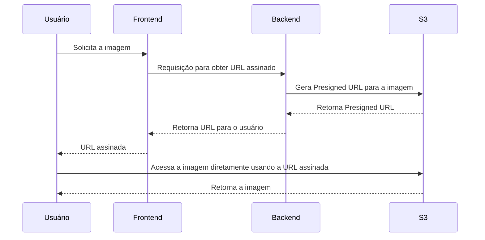

# Presigned URLs no S3: O que é e Como Funciona?

## Por Que Usar o Amazon S3 para Imagens/Objetos?

O Amazon S3 (Simple Storage Service) é uma solução de armazenamento em nuvem da AWS, ideal para armazenar arquivos, como imagens, vídeos, logs e documentos. Ele oferece:
- **Escalabilidade**: Lida com grandes volumes (storage e banda) de dados sem esforço.
- **Segurança**: Controle de acesso e permissões granulares.
- **Custo-efetivo**: Preço competitivo para armazenamento de dados a longo prazo.

## Problema: Controle de Acesso a Arquivos no S3

Normalmente, para acessar arquivos em um bucket S3, precisamos:
- Torná-los **públicos** (o que compromete a segurança), ou
- **Autenticar e autorizar** o acesso, o que pode ser complexo de implementar e gerenciar.

### Como o Presigned URL Resolve Esse Problema?

Com **Presigned URLs**, você pode gerar links temporários que concedem acesso a um arquivo específico no S3 por um período determinado. Isso permite que apenas usuários autorizados acessem o arquivo sem tornar o bucket público.

## O que é uma Presigned URL?

Uma **Presigned URL** é um link gerado com uma assinatura temporária, permitindo o acesso a um arquivo no S3 sem a necessidade de autenticação direta. Esse link expira após um tempo definido, garantindo maior segurança.

### Vantagens de Usar Presigned URLs

- **Segurança**: Controla o acesso a arquivos de forma temporária, sem expor o bucket.
- **Simplicidade**: Facilita o acesso ao conteúdo armazenado no S3 sem precisar implementar um sistema complexo de autenticação/authorization.
- **Performance**: Reduz a carga no servidor da aplicação, pois o download é feito diretamente do S3 para o cliente.

### Desvantagens de Usar Presigned URLs

- **Controle Limitado**: Uma vez gerada a URL, o controle do acesso fica com o cliente até a expiração.
- **Manutenção de Expiração**: Precisa gerenciar bem o tempo de expiração para balancear entre segurança e conveniência.
- **Vulnerabilidade de Compartilhamento**: Usuários podem compartilhar a URL com terceiros, que terão acesso enquanto o link estiver válido.

## Exemplo de conteúdo em webiste

```html

```

```html

```

## Como Usar Presigned URLs no Amazon S3

Exemplo em Go para gerar uma Presigned URL para um arquivo no S3:

```go
package main

import (
	"fmt"
	"time"

	"github.com/aws/aws-sdk-go/aws"
	"github.com/aws/aws-sdk-go/aws/session"
	"github.com/aws/aws-sdk-go/service/s3"
)

func main() {
	// Configura a sessão e o cliente S3
	sess := session.Must(session.NewSession(&aws.Config{
		Region: aws.String("us-east-1"),
	}))
	svc := s3.New(sess)

	// Parâmetros para a URL assinado
	bucket := "meu-bucket"
	key := "caminho/para/o/arquivo.jpg"
	expiration := 15 * time.Minute

	// Gera a Presigned URL
	req, _ := svc.GetObjectRequest(&s3.GetObjectInput{
		Bucket: aws.String(bucket),
		Key:    aws.String(key),
	})
	urlStr, err := req.Presign(expiration)

	if err != nil {
		fmt.Println("Erro ao gerar a URL:", err)
		return
	}

	fmt.Println("Presigned URL:", urlStr)
}
```

Esse código cria uma **Presigned URL** que permite o download de um arquivo do S3 pelo tempo especificado (15 minutos, neste caso).

### Fluxo Completo: Do Usuário ao Download da Imagem



Neste fluxo:
1. O usuário solicita uma imagem ao **Frontend**.
2. O **Frontend** envia uma requisição para o **Backend** para obter a Presigned URL.
3. O **Backend** solicita ao **S3** a geração de uma Presigned URL para o arquivo desejado.
4. O **S3** retorna a URL assinada ao **Backend**, que então envia a URL para o **Frontend**.
5. O **Frontend** entrega a URL assinada ao usuário.
6. O usuário utiliza essa URL para acessar o arquivo diretamente no **S3**.
   
---

- 📚 **Treinamentos**: [Treinamentos](https://mugnos-it.com/treinamentos/)

---

- 🧑‍🏫  **Nome**: [Douglas Mugnos](https://mugnos-it.com)
- 🎥 **YouTube**: [@DouglasMugnosit](https://www.youtube.com/@DouglasMugnosit)
- 📷 **Instagram**: [douglasmugnosit](https://www.instagram.com/douglasmugnosit/)
- 🌐 **Website**: [Mugnos-it](https://mugnos-it.com)
